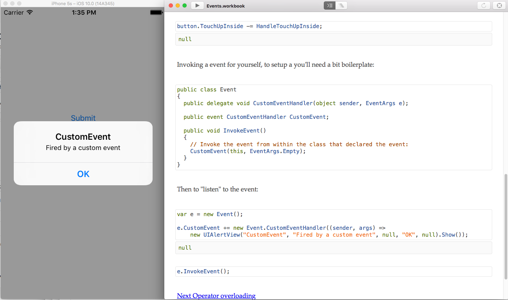

# dotnet-training
This repo was written to quick start android or iOS development in the world of Ms .Net.

The lessons use [Xamarin workbook](https://developer.xamarin.com/guides/cross-platform/workbooks/install/) to present `C#` code snippet.

## Pre-requisites

On macOS or Windows, download the community edition for:

* [Xamarin Studio 6+](https://developer.xamarin.com/guides/cross-platform/xamarin-studio/) 
* [Xamarin Workbook](https://developer.xamarin.com/guides/cross-platform/workbooks/)

## Basics

Start with `Basics.workbook` and follow the `Next` link.

In a command line:
```
open Basics.workbook
```


## Reference material

* [TutorialsPoint online classes](https://www.tutorialspoint.com/csharp)
* [learnCS.org](http://www.learncs.org/)
* [Introducing Xamarin Workbooks](http://conceptdev.blogspot.fr/2016/04/introducing-xamarin-workbooks.html)
* [Xamarin github example](https://github.com/xamarin/workbooks)
* [More Xamaring workbook samples for Andrdoid and iOS](https://github.com/xamarin/mobile-samples/)
* [C#6 What's new?](https://msdn.microsoft.com/en-us/magazine/dn802602.aspx)
* [Roslyn](https://github.com/dotnet/roslyn)
